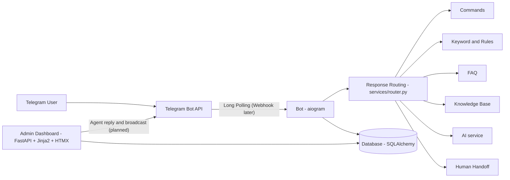

# Architecture

## Layers

| Layer | Folder | Notes |
|---|---|---|
| Bot | `app/bot/` | Handlers only talk to Telegram and call services |
| Business logic | `app/services/` | Routing, rules, AI, users, stats. No Telegram code here, so it is easy to test |
| Data | `app/models.py`, `app/db.py` | 16 ERD models plus `UnknownQuestion` |
| Admin | `app/web/` | Server-rendered pages; HTMX updates parts of a page without a full reload |

## Rules of thumb

- Keep secrets in `.env`, never in code.
- Put logic in `services/`, keep handlers and routes thin.
- Every new feature gets at least one test in `tests/`.
